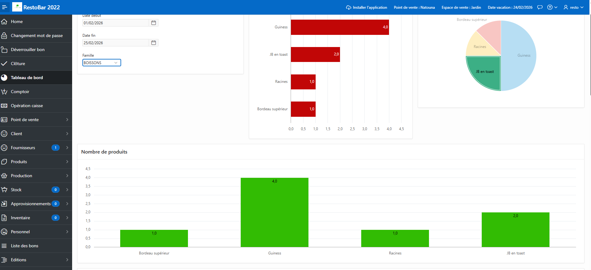
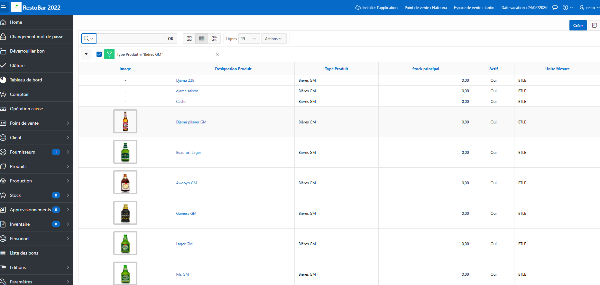
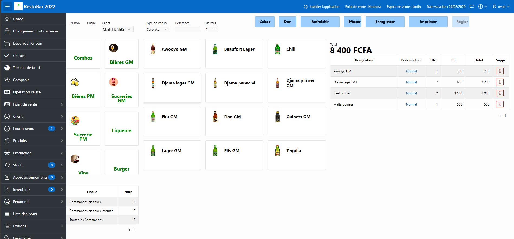

# Demo-Apex-Restaurant
Projet Apex
RestoBar 2022 est un logiciel de gestion complète d’un bar restaurant. Il intègre les fonctionnalités suivantes !
Tableau de bord : Histogrammes de progression des ventes
Comptoir : Vacation, ventes (Bons, règlements, clôture, opérations de caisse, éditions) 
Opération caisse  : Gestion des recettes et des dépenses, Situation de la caisse, Statistiques des dépenses
Pertes : Gestion des pertes (casses, incidents.) affectant le stock et les ventes
Client : Fiche, commandes et factures client
Fournisseur : Fiche, commandes et factures fournisseur
Produits : Gestion des produits, prix d’achat, prix de vente
Fiche technique :Paramétrage des repas et comptabilisation automatique du stock vendu
Stock : Stock initial, approvisionnements, livraison fournisseur, stock général, inventaire
Personnel : Personnel, profils, affectation
Editions : Journal des ventes, factures, fiche inventaire, ticket
Paramètres 

Architecture du projet
----------------------
/apex
    /app
   /workspace
/database
README.md
RestoBar_Prise_en_main.pdf

Installation & Déploiement
--------------------------
1. Pré-requis
•	Oracle Database 19c ou plus
•	Oracle APEX APEX 24.2.9 ou plus

2. Installation 
-  Créer un utilisateur base de données : restoadmin/admin
-  Exécuter le script : /database/demo_resto.sql
-  importe le workspace dans APEX (/apex/workspace/DEMO_RESTO.sql)
-  Utilisateur  : resto/admin
- Administrateur workspace : retoadmin/admin
-  Suivez le guide prise en main (Les images peuvent être différentes)
### Tableau de bord

### Gestion des produits

### Prise de commande

